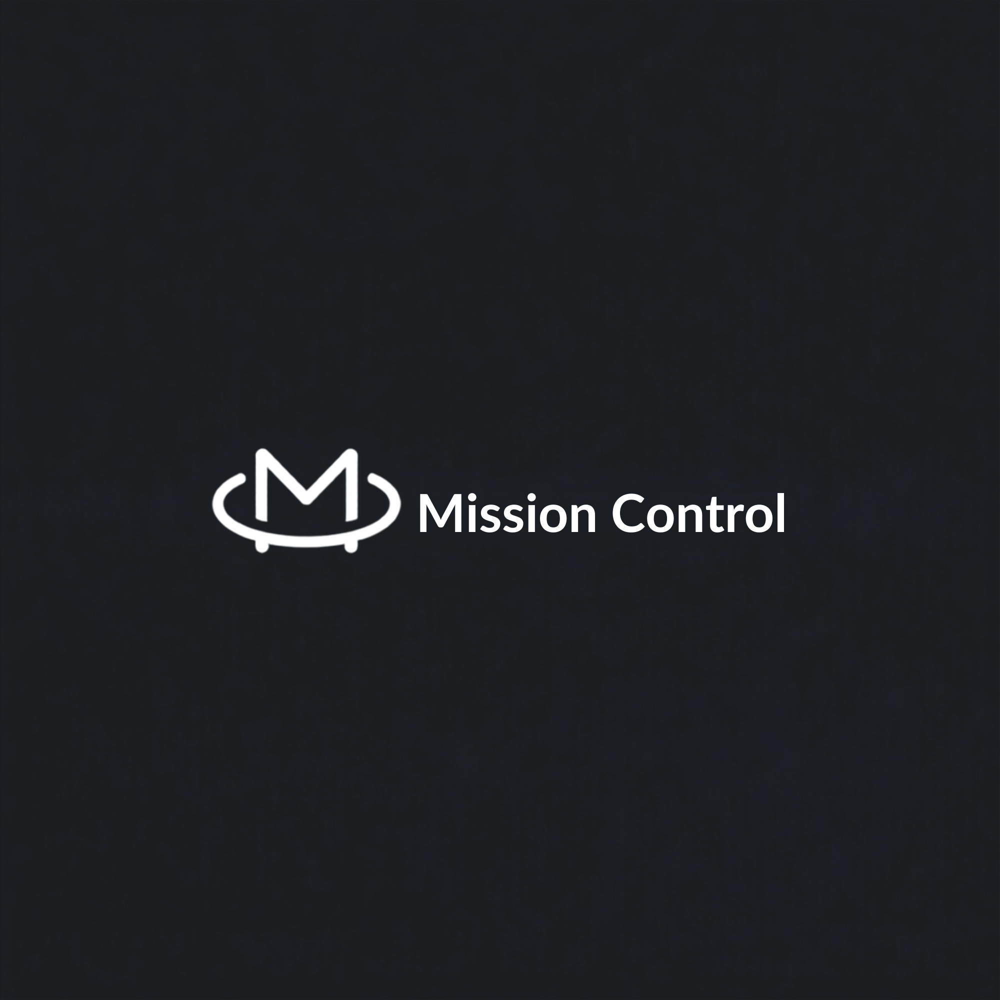

<p align="center">
  
</p>

<h1 align="center">Mission Control.ai</h1>

> Self-hosted dashboard for monitoring and managing multiple AI coding agent sessions — starting with Claude Code.

Mission Control gives you a single, real-time view of every AI coding session running across your machines: what it's working on, its git state, resource usage, and live logs — with the ability to stop or restart sessions from anywhere. Think Linear + Vercel, for your agents.

<p align="center">
  <em>Dark-mode-first · WebSocket-live · Provider-extensible</em>
</p>

## Features

- **Live fleet view** — every Claude Code session across local & remote machines, updating instantly over WebSocket.
- **Rich session pages** — Overview, Logs (ANSI, infinite scroll, search), read-only Terminal, Metrics (CPU/RAM graphs), and Git.
- **Machine inventory** — hostname, OS, CPU, RAM, live health.
- **Control plane** — stop / restart sessions remotely.
- **Provider system** — `AgentProvider` interface; **Claude Code, Codex CLI, and Gemini CLI** supported, with Aider / OpenHands / Roo / Continue designed in.
- **Multi-tenant** — workspaces with admin/member roles, admin-approved signups, and per-workspace machine isolation (one machine = one workspace).
- **Secure by default** — API-key auth, TLS-ready, no anonymous agents.
- **One command** — `docker compose up`.

## Architecture

```
┌────────────┐  WS/JSON   ┌────────────┐   REST + WS   ┌────────────┐
│   Agent    │──────────▶ │   Server   │ ◀───────────▶ │ Dashboard  │
│ (each host)│  sessions  │ (Go/Chi)   │   live diffs  │ (React SPA)│
└────────────┘  logs/metrics └────────────┘             └────────────┘
```

- **`apps/agent`** — Go daemon on every machine. Discovers Claude sessions, git repos, metrics; streams to the server.
- **`apps/server`** — Go control plane. Chi REST API, WebSocket hub, SQLite (GORM), state manager.
- **`apps/dashboard`** — React + Vite dashboard.

See [`docs/ARCHITECTURE.md`](docs/ARCHITECTURE.md), [`docs/PROTOCOL.md`](docs/PROTOCOL.md), [`docs/API.md`](docs/API.md), [`docs/SCHEMA.md`](docs/SCHEMA.md).

## Quick start

```bash
# 1. Start the control plane (one server hosts the API + dashboard + Postgres)
cd deploy && docker compose up
```

Open **http://localhost:8080** and sign in with the `ADMIN_EMAIL` /
`ADMIN_PASSWORD` from `docker-compose.yml`, then use **Add Machine** to enroll an
agent (install script / binary — each with a one-time token).

The single server serves everything on one port: `/api/v1` (REST), `/ws`
(WebSocket) and the dashboard SPA (with history-mode fallback).

## Development

```bash
pnpm install                                   # JS workspaces

# Option A — one server hosting the built SPA (production-like):
pnpm --filter @mc/dashboard build
MC_STATIC_DIR=apps/dashboard/dist JWT_SECRET=dev \
  ADMIN_EMAIL=a@b.com ADMIN_PASSWORD=password123 go run ./apps/server
# → http://localhost:8080

# Option B — Vite dev server with HMR, proxying to the API:
go run ./apps/server                           # API on :8080
pnpm --filter @mc/dashboard dev                # SPA on :5173 (proxies /api, /ws)

go run ./apps/agent                            # an agent
```

## Tech

React · TypeScript · Vite · TanStack Router/Query · Tailwind · shadcn/ui · Framer Motion · xterm.js · Zustand · Go 1.24 · Chi · GORM/SQLite · Zap · WebSocket.

## License

MIT
